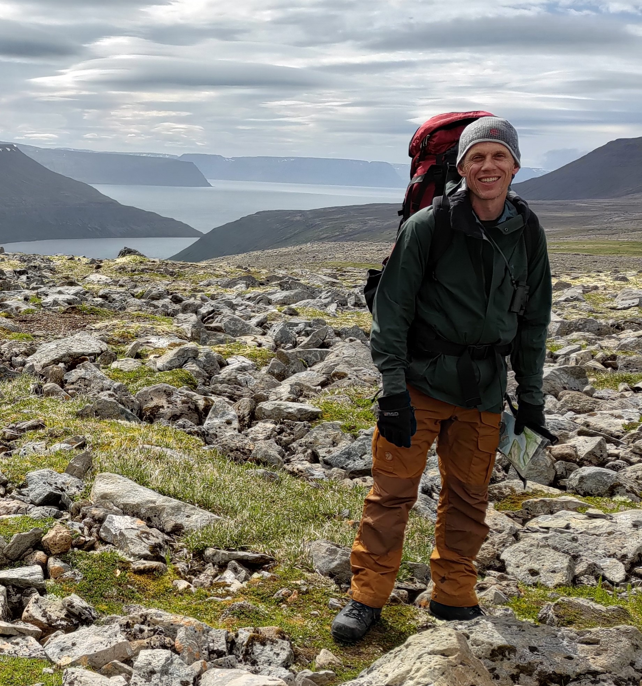
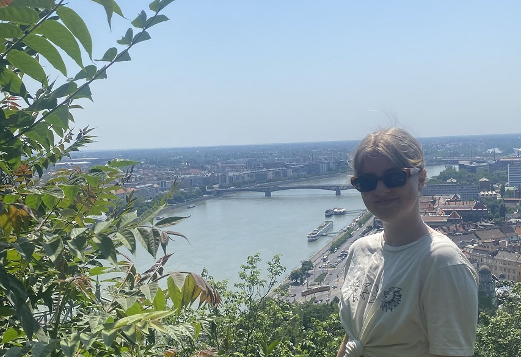
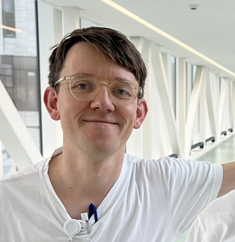
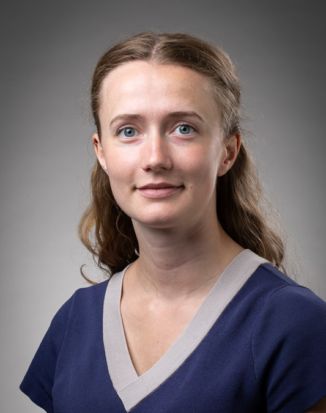
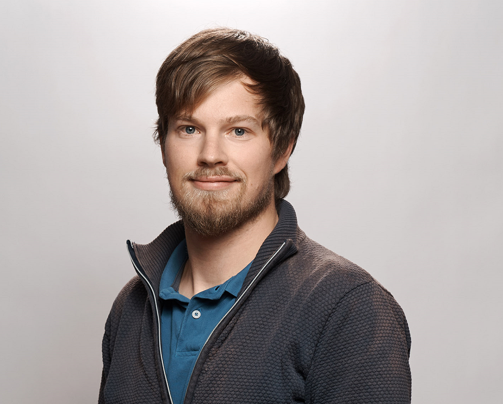
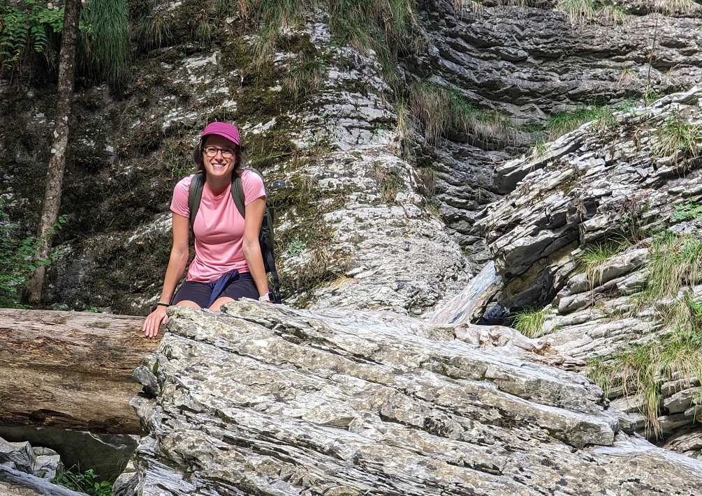
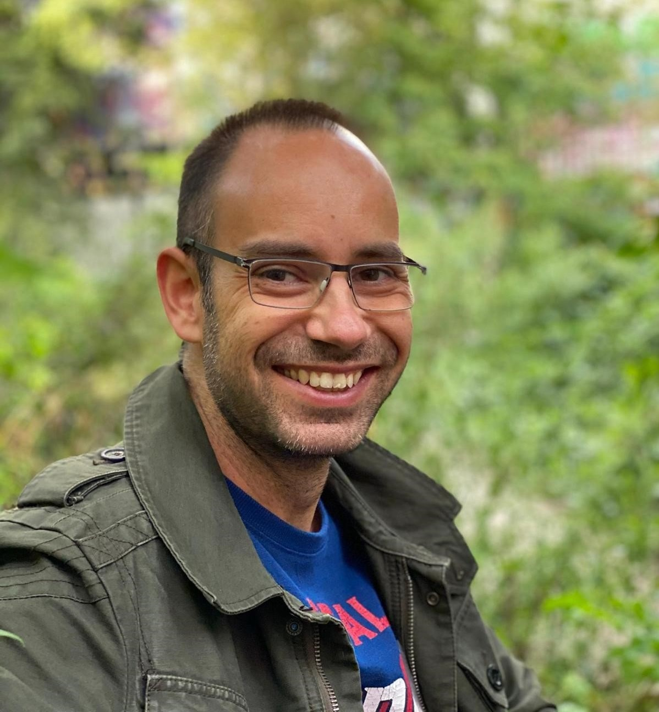

```{r setup, include=FALSE}
knitr::opts_chunk$set(echo = FALSE)
```
## Members of the lab:  


**Bjarke Feenstra**  
```{r, echo=FALSE, out.width = "300px"}

```
Senior researcher, group leader, professor  
[Bluesky](https://bsky.app/profile/bfeenstra.bsky.social)  
[LinkedIn](https://www.linkedin.com/in/bjarke-feenstra-6230374/)    
[Contact Bjarke](mailto:fee@ssi.dk)

**Frank Geller**  
Senior researcher  

```{r, echo=FALSE, out.width = "300px"}
knitr::include_graphics("images/FGE.jpg")
```

**Freja Dahl Hede**    
Bioinformatician

```{r, echo=FALSE, out.width = "300px"}

```

**Anders Husby**    
Researcher, MD, PhD

```{r, echo=FALSE, out.width = "300px"}

```

**Janne Auning Hansen**    
PhD student at Aarhus University (co-supervised by Bjarke)

```{r, echo=FALSE, out.width = "300px"}

```

**Katerina Nastou**    
Postdoc (primary advisor Heather Boyd, SSI. Joint projects with our group)

```{r, echo=FALSE, out.width = "300px"}
knitr::include_graphics("images/Katerina_Nastou2.jpg")
```

**Emil Jørsboe**    
Affiliated postdoc (primary advisor Torben Hansen, CBMR, KU. Joint projects with our group)

```{r, echo=FALSE, out.width = "300px"}

```

## Alumni:  

**Niklas Andersson**  
MD, PhD student 2021-2024

```{r, echo=FALSE, out.width = "300px"}
knitr::include_graphics("images/niklas.png")
```

**Giulia Barbieri**    
Visiting PhD student 2024

```{r, echo=FALSE, out.width = "300px"}

```

**Victor Yakimov**  
Bioinformatician, PhD student, Postdoc 2014-2024

```{r, echo=FALSE, out.width = "300px"}

```

**Xiaoping Wu**  
Postdoc 2021-2024

```{r, echo=FALSE, out.width = "300px"}
knitr::include_graphics("images/xiaoping.jpeg")
```
[GitHub](https://xiaoping-wu.github.io/XiaopingWu/)

**Salvör Ísberg**  
Student research assistant and Master's student 2021-2023 

```{r, echo=FALSE, out.width = "300px"}
knitr::include_graphics("images/slis_image.png")
```

**João Fadista**  
Postdoc and senior researcher 2015-2020

```{r, echo=FALSE, out.width = "300px"}

```

**Line Skotte**  
Postdoc and researcher 2015-2020

```{r, echo=FALSE, out.width = "50px"}
knitr::include_graphics("images/person-icon-1672 (1).png")
```

**Carmen Flores Bjurström**
MSc student, bioinformatics 2020

**Xueping Liu**
Postdoc 2015-2018

**Jonas Bille Nielsen**
Research visits 2018-2019

**Klaus Rune Christiansen**
MSc student, statistics 2016-2017

**Piotr Dworzynski**
Computer scientist 2015-2016

**Lisbeth Carstensen**
Statistician 2010-2014

**Thilde Marie Haspang** 
MSc student, statistics 2012-2013 

**Kåre Sylvest Jacobsen** 
MSc student, statistics 2011-2012 

**Gudmundur A. Hardarson** 
Visiting researcher 2010-2011

**Hao Zhang**
Bioinformatician 2009-2010
